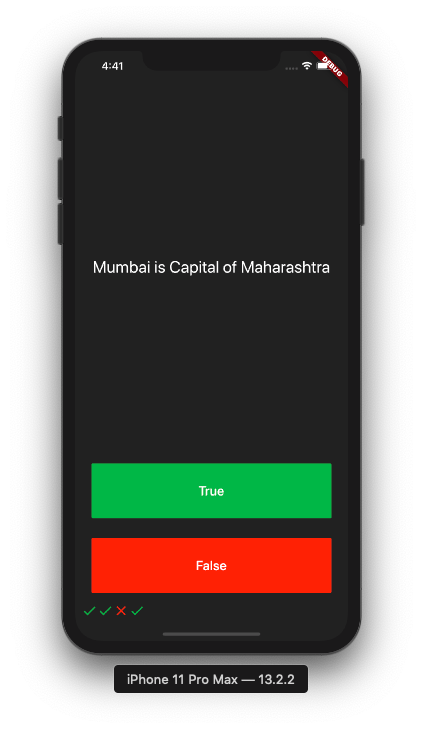
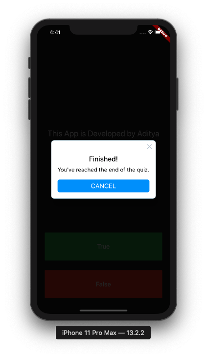

# Quizzler

The Quiz App developed in Flutter.

## ScreenShots
<table style="width:100%">
  <tr>
    <th>Quetions</th>
    <th>End</th>
  </tr>
  <tr>
    <td></td>
    <td></td>
  </tr>
</table>

## Details
This is Quiz App Developed in Flutter Framework

Features  
1) We can add Quetions/Answers 
2) It will show Right/Wrong icon when user start solving quetions

Contact :
Aditya Birangal
developer@birangal.com

### Credits
Special Thanks to [Angela Yu](https://www.linkedin.com/in/angela-yu-963a584b) for creating [Flutter Course](https://www.udemy.com/course/flutter-bootcamp-with-dart)

## Getting Started

This project is a starting point for a Flutter application.

A few resources to get you started if this is your first Flutter project:

- [Lab: Write your first Flutter app](https://flutter.dev/docs/get-started/codelab)
- [Cookbook: Useful Flutter samples](https://flutter.dev/docs/cookbook)

For help getting started with Flutter, view our
[online documentation](https://flutter.dev/docs), which offers tutorials,
samples, guidance on mobile development, and a full API reference.

